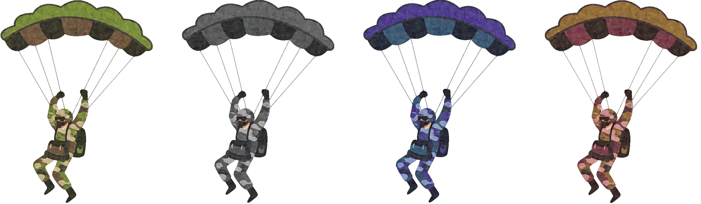

# Contested Sky

## Overview
**Contested Sky** is a classic 2D fixed shooter where the player must take down as many falling paratroopers as possible from a stationary position. The game challenges your speed and precision. The game is developed using SFML (Simple and Fast Multimedia Library) and showcases a mix of gameplay elements, visuals, and sound effects including soundtrack.

## Disclaimer
This is an older project developed in 2022. It does not reflect my current coding standards or design approach. It was my first experience with both SFML and object-oriented programming in C++.

## Story
Set in an alternate timeline where Napoleon Bonaparte successfully invades the British Isles, France becomes the dominant power in Western Europe. However, a new superpower — the Central Eurasian Empire — rises in the East, eventually conquering most of Asia.

After centuries of peace, tensions reignite when the Eurasian Empire initiates a blockade of Crete and launches an airborne invasion, led by special forces (VDV). As paratroopers descend on the island, one unlikely hero — a Greek patriot armed with a dart rifle — stands as the last line of defense.

With the French Empire fractured and the Olive Republic under threat, the fate of Europe lies on his shoulders.

## Gameplay
- **Objective:** Incapacitate as many foes as possible, survive for as long as you can with limited hearts - do not allow the airborne forces to land!
- **Controls:**
  - Use the mouse to aim at the paratropers.
  - Press LMB to cut sever parachutes.
  - Use the keyboard to reload your rifle.
- **Tips**:
  - You can hit multiple targets with a single shot.
  - Trees may obscure enemies near the ground, but shots pass through.
  - Prioritize faster enemies.
- **Enemies:** The game features multiple enemy types:
  - *Green*:
    - Speed: Normal
    - Health: 1
  - *Gray*:
    - Speed: Low
    - Health: 3
  - *Blue*:
    - Speed: Very High
    - Health: 1
  - *Brown*:
    - Speed: High
    - Health: 2
    
  

## Installation
1. Download the  release from the [Releases](https://github.com/Filip-Rak/Contested-Sky/releases/tag/v1.0) page.
2. Extract the ZIP file to a folder of your choice.
3. Run `contested_sky.exe` to start the game.

## Requirements
- Windows OS
- Mouse
- Keyboard
- OpenAL (included in the release)
- SFML DLLs (included in the release)

## Credits
- **Development:** [Filip](https://github.com/Filip-Rak)
- **Art** [Nopee](https://github.com/fakeNopee)
